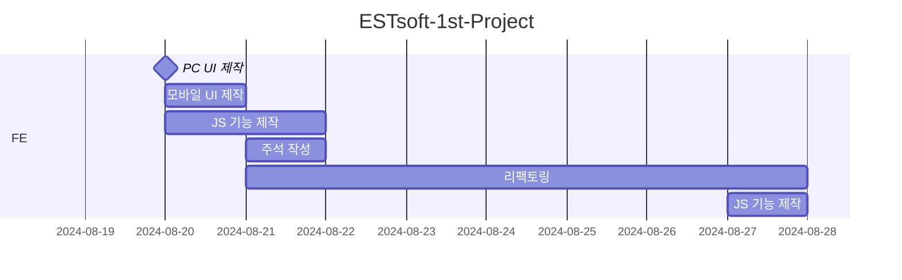

# ESTsoft 프론트엔드 프로젝트

## 1. 목표와 기능

### 1.1 목표

- 피그마 링크와요구사항 명세를 참고하여 랜딩 페이지 작성
- 모바일 화면도 고려

### 1.2 기능

- 반응형 웹으로 구현하여 모바일 환경에서도 이용 가능
- 카카오 맵으로 위치 확인 가능
- 상단 이동 버튼으로 클릭 시 부드러운 이동 가능
- 모바일 메뉴를 열고 닫을 때 자연스럽게 움직임
- 이메일 입력 시 유효성 검사를 통해 경고창을 띄움
- Subscribe 버튼 클릭 시 모달창이 열림
- 모달창 버튼 클릭 시 form 제출 및 모달창 닫힘
- 모달창이 열렸을 때 스크롤 제한
- 모달창 외부 클릭 시 모달창 닫힘
- 일정량 스크롤 시 헤더를 상단에 고정
- lodash 라이브러리를 통해 특정 시간안에 이벤트 중복 발생 시 1번만 실행

## 2. 개발 환경 및 배포 URL

### 2.1 개발 환경

- Web Framework
    - Native
- IDE
    - IntelliJ
- 서비스 배포 환경
    - GitHub Pages
- 기타 사항
    - Figma

### 2.2 서비스 URL 정보

- 실행 URL: https://jindo-dog.github.io/ESTsoft-1st-Project/
- GitHub repo: https://github.com/Jindo-Dog/ESTsoft-1st-Project

## 3. 요구사항 명세

1. 피그마를 참고하여 페이지 구현을 합니다.
2. 모바일 화면도 고려하여 페이지 구현을 합니다.
3. 스크롤시 헤더가 고정되게 합니다. (단, 처음에는 고정된 상태가 아닙니다.)
4. 스크롤 탑 버튼을 구현합니다.
    - 스크롤 탑 버튼은 스크롤시 나타납니다.
    - 스크롤 탑 버튼은 푸터 아래로 내려가지 않습니다.
    - 스크롤 탑 버튼을 누르면 스크롤이 최상단으로 올라갑니다. (단, 부드럽게 올라가야 합니다.)
5. 구독하기 모달창
    - 이메일을 입력하고 `Subscribe` 버튼을 클릭하면 모달창이 나타납니다.
    - 이메일 유효성 검사를 진행해야 합니다. (값이 들어가지 않거나 이메일 형식이 유효하지 않으면 alert 창으로 경고 문구가 떠야합니다.)
    - 이메일이 잘 입력되었다면 모달창이 뜹니다. 이때 모달창의 `OK! I love HODU` 버튼을 클릭하면 form이 제출되고 모달창이 닫힙니다.

## 4. 프로젝트 구조와 개발 일정

### 4.1 프로젝트 구조

- 해당 프로젝트에서 폴더 트리 잘 다듬어 사용하세요. 필요하다면 주석을 달아주세요.
- 📦root  
  ┣ 📂assets  
  ┃ ┣ 📂cat   
  ┃ ┣ 📂icon  
  ┣ 📜index.html  
  ┣ 📜index.css  
  ┣ 📜index-mobile.css  
  ┣ 📜index.js  
  ┣ 📜map.js  
  ┣ 📜README.md  
  ┗ 📜reset.css

### 4.2 개발 일정

## 5. UI

<table style="text-align: center">
    <tr>
        <th style="width: 50%;">main</th>
        <th style="width: 50%;">mobile</th>
    </tr>
    <tr>
        <td></td>
        <td></td>
    </tr>
    <tr>
        <th colspan="2">modal</th>
    </tr>
    <tr>
        <td></td>
        <td></td>
    </tr>
    <tr>
        <th>hover</th>
        <th>menu</th>
    </tr>
    <tr>
        <td></td>
        <td></td>
    </tr>
</table>

## 6. 에러와 에러 해결

- 줄바꿈 했을 때 공백문자가 남아있어 정렬에 문제 발생
    - 해결: `white-space: pre-line;` 속성을 사용하여 해결
- 모달창이 열렸을 떄 상단으로 스크롤 되는 현상
    - 해결: `preventDefault()`를 사용하여 해결
- 모달창 구현 시 `display: none;`을 사용하여 표시되지 않게 하였으나. 모당창 내부 요소를 구현하려면 display 속성을 변경해야 함
    - 해결: `[open]` 선택자를 부여하여 열렸을 때 display 속성을 변경함
- 이메일 input에서 Enter 키를 누르면 form이 제출되는 현상
    - 해결: `preventDefault()` 사용 및 버튼 클릭 이벤트 발생으로 해결
- 스크롤 이벤트 발생 시 로그가 출력되게 했을 때 매우 많은 로그가 한번에 출력되는 현상 발생
    - 해결: lodash 라이브러리의 `_.throttle()`을 사용하여 특정 시간안에 이벤트 중복 발생 시 1번만 실행하도록 하여 성능 향상
- 모달창 외부 클릭 시 모달창이 닫혀야 하는데 내부 배경을 클릭해도 닫히는 현상 발생
    - 해결: dialog 내부에 별도의 div 컨테이너를 구성하여 이벤트를 막음
- 모달창이 열렸을 때 스크롤이 되지 않게 하기 위해 `overflow: hidden;`을 사용하여 스크롤을 제한하였는데, 페이지 기반이 뷰포트여서 레이아웃이 변경되는 현상 발생
    - 해결: html에 `width: 100vw;`를 사용하여 스크롤바 너비까지 유지하고, `overflow-x: hidden;`을 사용하여 넘치는 것을 숨겨 해결

## 7. 개발하며 느낀점

- 반응형 웹 디자인의 중요성
    - 모바일과 데스크탑 환경 모두를 고려하여 반응형 웹을 구현하는 과정에서, 화면 크기와 해상도에 따라 디자인을 어떻게 구현해야 하는지를 고민하게 되었습니다. 모바일 화면을 구현하는 것이 생각보다 까다로웠지만, 미디어 쿼리를 활용하여 문제를 해결하며 반응형 웹 디자인의 중요성을 실감했습니다.
- 문제 해결 능력 향상
    - 개발 중 위처럼 여러 가지 예기치 않은 문제가 발생했습니다. 이런 문제들을 해결하는 과정에서 문제 분석과 해결 능력이 많이 향상되었습니다.
- 코드 유지보수의 중요성
    - 프로젝트 리팩토링 과정에서 코드의 가독성과 유지보수성의 중요성을 깨달았습니다. 코드의 구조를 깔끔하고 명확하게 유지하는 것이 추후 기능 추가나 버그 수정에 있어 큰 도움이 되었습니다. 주석을 달고, 명확한 변수명을 사용하여 코드를 작성하려고 노력하는 것이 중요하다는 것을 깨달았습니다.
